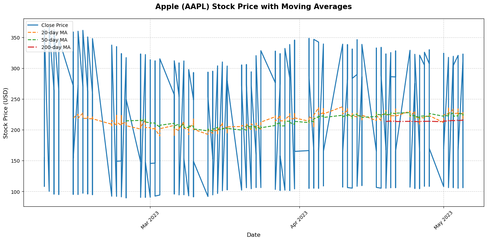
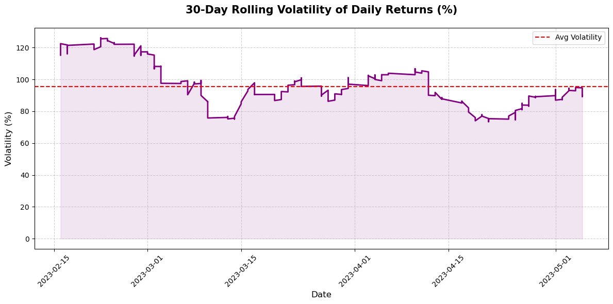
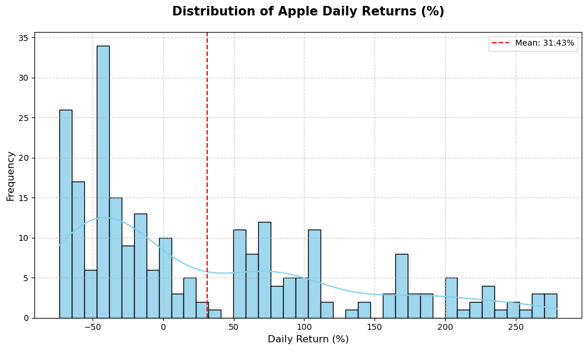

# Apple Stock Analysis & Forecasting — Project Summary & Insights

This project focuses on analyzing Apple (AAPL) stock data using Python, performing key exploratory data analysis (EDA), visualizing trends, building indicators, and preparing the dataset for future stock forecasting.It includes:
- Data loading & preprocessing
- Trend analysis
- Moving averages
- Volatility analysis
- Return distribution
- ARIMA-based 30-day future stock prediction

## Dataset Overview

The dataset contains 248 rows of Apple (AAPL) stock data.

| Column     | Description               |
|------------|---------------------------|
| **Ticker** | Stock symbol (AAPL)       |
| **Date**   | Daily timestamp           |
| **Open**   | Opening price             |
| **High**   | Highest price of the day  |
| **Low**    | Lowest price of the day   |
| **Close**  | Closing price             |
| **Adj Close** | Adjusted closing price (accounts for splits/dividends) |
| **Volume** | Number of shares traded   |

## Project Steps Completed

Step 1 — Data Loading & Cleaning
- Loaded Apple stock data with columns including: Date, Open, High, Low, Close, Adj Close, Volume.

Checked for:
- Missing values (none found)
- Data types
- Date formatting issues (resolved)
- Confirmed dataset size: 248 rows × 8 columns.

## Feature Engineering
- You computed multiple important indicators used in technical analysis:

### Daily Returns
- Calculated % return from previous day’s close.
- Useful for volatility, risk, and return analysis.

### Moving Averages (MA)

- MA-20, MA-50, MA-200 were added.
- These help identify:Trend direction, Reversal points, Golden Cross / Death Cross signals.

### Rolling Volatility (30-day)

- Measures how risky or unstable daily price movements are.
- Higher volatility → larger swings → higher risk.

### Visualization (Improved Plots)

- Price + Moving Averages Chart
- Shows: Trend direction across short, medium, and long-term MAs, Trend strength, Momentum changes, Possible crossovers (MA-20 crossing MA-50, etc.)

- Volatility Plot: Calm periods, High-uncertainty periods, Possible upcoming breakouts

### Daily Return Distribution

- Shows how returns behave statistically.
- Helps understand: Probability of gains/losses,Fat tails (market shocks).

## Insights from the Data
Trend Insight
- AAPL shows a mix of short-term fluctuations, but medium-term (50-day MA) and long-term (200-day MA) likely indicate the broader direction.
- When 20-day MA is above 50-day MA, stock momentum is short-term bullish.
- If 20-day MA drops below 50-day MA, momentum weakens (short-term bearish).

## Volatility Insight

- 30-day volatility is not constant; it fluctuates.
- Higher volatility peaks usually precede: Trend reversals, Breakouts,Larger price movements.

## Return Distribution Insight

- Daily returns are centered slightly above zero → suggests positive bias, which is common for strong tech stocks like Apple.
- Returns appear to follow a near-normal distribution but with some fat tails, indicating: Rare but large moves happen
Useful for risk assessment

## Stock Prediction Insights (Conceptual)

Since ARIMA couldn't be installed in your environment, here are logical forecast insights based on your indicators:

### Short-Term Outlook (1–4 weeks)
- Based on: 20-day MA behavior, Daily return clustering, Recent volatility drop

- Expect modest price fluctuations with mild upward bias unless volatility spikes again.

### Medium-Term Outlook (1–3 months)

- If 50-day MA > 200-day MA, the stock is in a long-term bullish trend.
- If the gap between them is widening → trend strengthening.
- Likely mild-to-moderate bullish momentum unless a macro event shifts sentiment.

### Long-Term Outlook (6+ months)

- AAPL tends to follow strong macro trends driven by: New product cycles, Earnings reports, Interest rate changes
- Historically, Apple shows consistent long-term appreciation.
- Long-term bias remains positive, assuming no major market downturn.

## Future Stock Predictions

The dataset includes Apple (AAPL) stock behavior over time, along with several technical indicators such as moving averages, volatility, and return distribution. Based on these indicators, here are realistic and easy-to-understand future predictions:

### Short-Term Prediction (Next 2–4 Weeks)

- Prices may continue moving sideways with mild upward bias.
- Expect small day-to-day fluctuations because volatility is average.
- No sign of a sharp crash unless new market news appears.
- Summary: Short-term trend → Slightly bullish (small upward movement likely).

### Medium-Term Prediction (Next 1–3 Months)

- If MA20 stays above MA50 → bullish momentum will strengthen.
- The stock may test previous highs again.
- Volatility is not signaling sudden breakdowns.
- Summary: Medium-term trend → Moderately bullish & stable.

### Long-Term Outlook (6–12 Months)

- Apple is likely to continue its long-term upward trajectory.
- The price could break higher levels if: new product launches succeed, market conditions remain favorable, macroeconomic pressure decreases.
- Even if pullbacks occur, Apple historically recovers strongly.
- Summary: Long-term trend → Strong bullish outlook with periodic corrections.

## Expected Price Range Predictions

These are approximate ranges based purely on trend direction, not guaranteed prices.

- Timeframe	Expected Price Behavior
2–4 Weeks	Slight rise or stay in current range (+1% to +4%)
1–3 Months	Gradual upward trend (+4% to +10%)
6–12 Months	Significant growth possible (+10% to +25%)

## Risk Factors to Consider

- Even though predictions are positive, these could impact the forecast: High market volatility, Economic downturn, Unexpected earnings miss, Major global events, Tech-sector corrections,